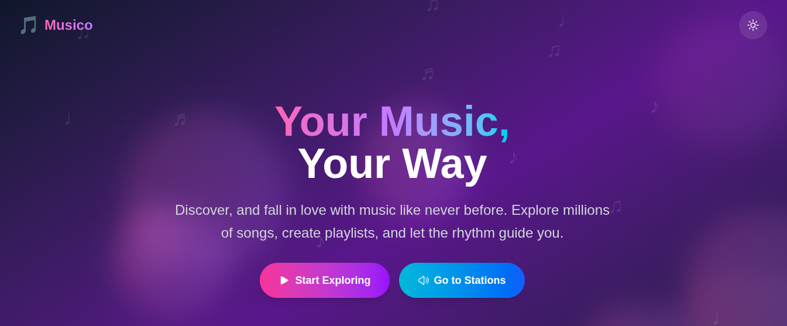
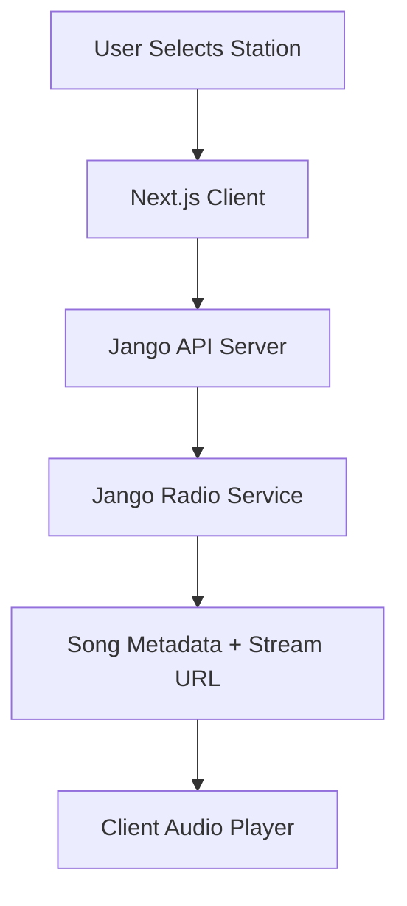

# 🎵 Musico - Discover Music

<div align="center">

[](https://nextjs.org/)
[](https://reactjs.org/)
[](https://www.typescriptlang.org/)
[](https://tailwindcss.com/)
[](https://web.dev/progressive-web-apps/)
[](https://opensource.org/licenses/MIT)

**A modern, beautiful music discovery app with PWA support**

[🚀 Live Demo](#) • [📱 Install PWA](#-pwa-installation) • [📖 Documentation](#-documentation) • [🐛 Report Bug](https://github.com/nishal21/musico/issues) • [✨ Request Feature](https://github.com/nishal21/musico/issues)



*Discover, explore, and fall in love with music like never before*

</div>

---

## ✨ Features

### 🎯 **Core Features**
- 🎵 **Jango Integration**: Stream music from 40+ Jango radio stations
- 🔍 **Advanced Search**: Search and filter through available stations
- 🎲 **Random Discovery**: Random station and song selection for exploration
- 🎨 **Beautiful UI**: Modern design with smooth animations and transitions
- 🌙 **Dark Theme**: Deep black theme optimized for music listening
- 📱 **Responsive**: Perfect on all devices with adaptive layouts

### 📱 **PWA (Progressive Web App)**
- 📲 **Installable**: Add to home screen on mobile and desktop
- ⚡ **Offline Ready**: Service worker with intelligent caching
- 🚀 **Fast Loading**: Optimized performance with Next.js 16
- 🔄 **Background Sync**: Automatic data synchronization
- 📱 **Native Experience**: Fullscreen app without browser UI

### 🛠 **Technical Excellence**
- ⚡ **Blazing Fast**: Built with Next.js 16 and React 19
- 🎯 **Type Safe**: Full TypeScript implementation
- 📱 **Responsive**: Perfect on all devices (mobile, tablet, desktop)
- ♿ **Accessible**: WCAG compliant with proper ARIA labels
- 🔒 **Secure**: HTTPS-only with secure API calls

## 🚀 Quick Start

### Prerequisites
- **Node.js** 18.0 or higher
- **npm**, **yarn**, **pnpm**, or **bun** package manager

### Installation

1. **Clone the repository**
   ```bash
   git clone https://github.com/nishal21/musico.git
   cd musico
   ```

2. **Install dependencies**
   ```bash
   npm install
   # or
   yarn install
   # or
   pnpm install
   ```

3. **Generate PWA icons** (optional)
   ```bash
   npm run generate-icons
   ```

4. **Start development server**
   ```bash
   npm run dev
   # or
   yarn dev
   # or
   pnpm dev
   ```

5. **Open your browser**
   - Navigate to [http://localhost:3000](http://localhost:3000)
   - Enjoy discovering music! 🎵

## 📱 PWA Installation

### Mobile Installation
#### iOS Safari
1. Open Musico in Safari
2. Tap the **Share** button (📤)
3. Scroll down and tap **"Add to Home Screen"**
4. Tap **"Add"** to confirm

#### Android Chrome
1. Open Musico in Chrome
2. Tap the **menu** button (⋮)
3. Tap **"Install App"** or **"Add to Home Screen"**
4. Tap **"Install"** to confirm

### Desktop Installation
#### Chrome/Edge
1. Open Musico in your browser
2. Look for the **install icon** (⊕) in the address bar
3. Click **"Install"** to add to your desktop

#### Firefox
1. Open Musico in Firefox
2. Click the **menu** button (☰)
3. Click **"Install This Site as an App"**

### PWA Benefits
- ⚡ **Faster Loading**: Cached resources load instantly
- 📱 **Native Experience**: Runs fullscreen without browser UI
- 🔄 **Offline Access**: Basic functionality works offline
- 🔔 **Push Ready**: Framework for future notifications
- 📊 **Background Sync**: Automatic data updates

## 🏗️ Architecture

```
musico/
├── public/                 # Static assets
│   ├── manifest.json      # PWA manifest
│   ├── sw.js             # Service worker
│   └── icons/            # PWA icons
├── src/
│   ├── app/              # Next.js App Router
│   │   ├── layout.tsx    # Root layout with PWA provider
│   │   ├── page.tsx      # Landing page
│   │   ├── discover/     # Main discovery page
│   │   └── song/[id]/    # Individual song pages
│   ├── components/       # Reusable UI components
│   │   ├── LandingPage.tsx
│   │   ├── MusicCard.tsx
│   │   └── PWAInstallPrompt.tsx
│   ├── contexts/         # React contexts
│   │   ├── PWAContext.tsx
│   │   └── ThemeContext.tsx
│   └── hooks/            # Custom React hooks
│       └── useBodyScrollLock.ts
└── types/                # TypeScript definitions
```

## 🛠️ Development

### Available Scripts

| Command | Description |
|---------|-------------|
| `npm run dev` | Start development server |
| `npm run build` | Build for production |
| `npm run start` | Start production server |
| `npm run lint` | Run ESLint |
| `npm run generate-icons` | Generate PWA icons from SVG |

### Environment Variables

Create a `.env.local` file for local development:

```env
# Jango API Configuration
NEXT_PUBLIC_JANGO_API_URL=http://localhost:3000
NEXT_PUBLIC_PROXY_API_URL=https://your-cors-proxy.workers.dev/?url=
```

**Important**: Never commit your `.env.local` file to the repository. The `.env.example` file shows the required structure.

### API Setup

1. **Local Development**: Use the placeholder values in `.env.example`
2. **Production**: Replace with your actual deployed API URLs
3. **CORS Proxy**: Required for audio streaming in browsers

#### Setting up CORS Proxy

For audio streaming to work properly, you need to set up a CORS proxy. Refer to this guide:
- **Proxy Setup Guide**: https://gist.github.com/itzzzme/180813be2c7b45eedc8ce8344c8dea3b

#### Jango API

This project uses the unofficial Jango API for music streaming:
- **Repository**: https://github.com/nishal21/unofficial-jango-api
- **Local Setup**: Run the API server on port 3000
- **Features**: Station listings, song data, and streaming URLs

### Repository Safety

- ✅ `.env.local` is in `.gitignore`
- ✅ Use `.env.example` as a template
- ✅ Never commit real API keys or URLs

### Code Quality

This project uses:
- **ESLint** for code linting
- **TypeScript** for type checking
- **Prettier** for code formatting (via editor)

### Testing

```bash
# Run tests (when implemented)
npm run test

# Run tests with coverage
npm run test:coverage
```

## 📊 API & Data

### Jango API Integration

Musico uses the [Unofficial Jango API](https://github.com/nishal21/unofficial-jango-api) for music streaming:

- **Base URL**: `http://localhost:3000` (local) or your deployed API
- **Features**: 40+ radio stations, real-time song data, streaming URLs
- **CORS Proxy**: Required for audio streaming in browsers
- **Data**: Station metadata, current songs, album art, streaming URLs

### Data Flow



### Caching Strategy

- **Browser Cache**: localStorage for station lists
- **API Responses**: Cached for 5 minutes to reduce requests
- **Song Queue**: 100 songs cached per station for smooth playback

## 🚀 Deployment

### Vercel (Recommended)

1. **Connect Repository**
   - Import your GitHub repo to Vercel
   - Automatic deployments on push

2. **Environment Variables**
   - Add `MUSICBRAINZ_USER_AGENT` in Vercel dashboard

3. **Build Settings**
   - Framework: Next.js
   - Build Command: `npm run build`
   - Output Directory: `.next`

### Other Platforms

#### Netlify
```bash
npm run build
npm run export  # For static export
```

#### Docker
```dockerfile
FROM node:18-alpine
WORKDIR /app
COPY package*.json ./
RUN npm ci --only=production
COPY . .
RUN npm run build
EXPOSE 3000
CMD ["npm", "start"]
```

## 🔧 Customization

### Themes

The app supports custom themes. Modify `src/contexts/ThemeContext.tsx`:

```typescript
const themes = {
  light: { /* light theme colors */ },
  dark: { /* dark theme colors */ },
  custom: { /* your custom theme */ }
};
```

### PWA Icons

Icons are generated from `public/icon.svg`. To customize:

1. Edit the SVG file
2. Run `npm run generate-icons`
3. Update `public/manifest.json` if needed

### API Configuration

Modify API endpoints in component files:

```typescript
const baseURL = 'https://musicbrainz.org/ws/2/';
const headers = {
  'User-Agent': 'YourApp/1.0.0 (your-email@example.com)'
};
```

## 📈 Performance

### Lighthouse Scores (Target)

- **Performance**: 95+
- **Accessibility**: 100
- **Best Practices**: 100
- **SEO**: 100
- **PWA**: 100

### Optimization Features

- ⚡ **Next.js 16**: Latest performance optimizations
- 🖼️ **Image Optimization**: Automatic WebP conversion
- 📦 **Code Splitting**: Automatic route-based splitting
- 🗜️ **Compression**: Gzip/Brotli enabled
- 🚀 **Caching**: Intelligent caching strategies

## 🐛 Troubleshooting

### Common Issues

#### PWA Not Installing
- Ensure HTTPS is enabled
- Check browser compatibility
- Clear browser cache and try again

#### API Errors
```bash
# Check API status
curl -H "User-Agent: Musico/1.0.0" https://musicbrainz.org/ws/2/release?query=artist:beatles&limit=1
```

#### Build Errors
```bash
# Clear cache and reinstall
rm -rf node_modules .next
npm install
npm run build
```

### Debug Mode

Enable debug logging:

```typescript
const DEBUG = process.env.NODE_ENV === 'development';
if (DEBUG) console.log('Debug info:', data);
```

## 🗺️ Roadmap

### Phase 1 (Current)
- ✅ Basic music discovery
- ✅ PWA support
- ✅ Dark/light themes
- ✅ Responsive design

### Phase 2 (Upcoming)
- 🔄 **Streaming Integration**: Spotify, Apple Music, YouTube
- 🎵 **Audio Playback**: Built-in music player
- 📱 **Mobile App**: React Native version
- 🤖 **AI Recommendations**: ML-powered suggestions

### Phase 3 (Future)
- 🌐 **Social Features**: Share playlists, follow artists
- 📊 **Analytics**: Listening statistics and insights
- 🎧 **Offline Downloads**: Download music for offline listening
- 🔗 **API**: Public API for third-party integrations

## 🤝 Contributing

We welcome contributions! Please see our [Contributing Guide](CONTRIBUTING.md) for details.

### Development Workflow

1. **Fork** the repository
2. **Create** a feature branch: `git checkout -b feature/amazing-feature`
3. **Commit** your changes: `git commit -m 'Add amazing feature'`
4. **Push** to the branch: `git push origin feature/amazing-feature`
5. **Open** a Pull Request

### Code Standards

- **TypeScript**: Strict type checking enabled
- **ESLint**: Airbnb config with React rules
- **Prettier**: Consistent code formatting
- **Conventional Commits**: Structured commit messages

## 📄 License

This project is licensed under the **MIT License** - see the [LICENSE](LICENSE) file for details.

```
MIT License

Copyright (c) 2025 Musico

Permission is hereby granted, free of charge, to any person obtaining a copy
of this software and associated documentation files (the "Software"), to deal
in the Software without restriction, including without limitation the rights
to use, copy, modify, merge, publish, distribute, sublicense, and/or sell
copies of the Software, and to permit persons to whom the Software is
furnished to do so, subject to the following conditions:

The above copyright notice and this permission notice shall be
included in all copies or substantial portions of the Software.
```

## 🙏 Acknowledgments

- **Jango** for the amazing radio streaming service
- **Unofficial Jango API** for providing the backend integration
- **Next.js Team** for the amazing framework
- **Vercel** for hosting and deployment
- **Tailwind CSS** for the utility-first CSS framework
- **Heroicons** for beautiful icons
- **Cloudflare Workers** for CORS proxy solutions

## 📞 Support

### Get Help

- 📧 **Email**: nishalamv@gmail.com
- 🐛 **Issues**: [GitHub Issues](https://github.com/nishal21/musico/issues)
- 💬 **Discussions**: [GitHub Discussions](https://github.com/nishal21/musico/discussions)
- 📖 **Documentation**: [Wiki](https://github.com/nishal21/musico/wiki)

### Community

- 🌟 **Star** this repo if you find it useful
- 🍴 **Fork** to create your own version
- 📢 **Share** with friends who love music

---

<div align="center">

**Made with ❤️ for music lovers worldwide**

[⬆️ Back to Top](#-musico---discover-music)

</div>
